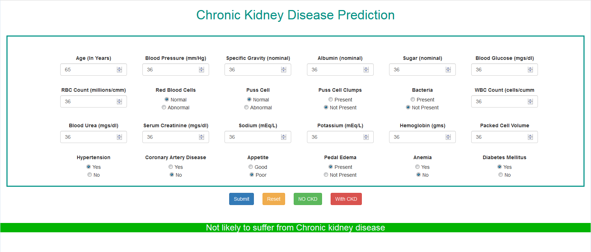

## Chronic Kidney Disease Prediction ##

### _Machine learning + Angular2 + Python Tornado + Docker_ ###



Watch it live at - http://ckd-website.s3-website.ap-south-1.amazonaws.com/

The front end is developed on Angular Framework, deployed on AWS

## Running & Building the Apps via Docker ##

- Make sure to install docker on your machine
- For windows 7 users, 
  - download docker toolbox - https://docs.docker.com/toolbox/toolbox_install_windows/
  - Open docker quickstart terminal
    - `cd /ckd-app`
    - `docker-compose build frontend-s` & `docker-compose build backend-s`
    - OR simply run - `docker-compose up` (this will build and run both the frontend and backend applications).
  - Launch Powershell or cmd
    - `docker-machine ls`
    - `docker-machine env <docker-name>` <docker-name> is mostly `default`
    - Copy and execute the last command displayed after running the above command.
    - Docker is now hooked. You can now run all the docker commands.
- For windows 10 users,
  - Download and install docker
  - Start powershell or cmd and change directory to the ckd-app folder.
  - Run - `docker-compose up`
- you can run - `docker ps -a` to view the running containers
- Open browser and go to - localhost:4200 to view the website
- For Win. 7 users, the url to give in the browser will be IP mentioned at the start of docker qucikstart terminal - for eg: "docker is configured to use the default machine with IP 192.168.99.100".
  In this case browse the website at - 192.168.99.100:4200


## Running the Apps on their own ##

The web application consists of -

1. Web application (web site) - Angular2 application - `ckd-angular-app`
2. Tornado web server application - Tornado python server - `health_predictor_tornado_app`


### Steps to set up and run Tornado Web application ###

- Install anaconda 3 for python
- Run main.py file from `health_predictor_tornado_app` directory
  - To run main.py, either open the project in pycharm, set anaconda python3 as the interpretor, and run main.py
  - Else, type anaconda in start menu - 
    - click on anaconda prompt menu
    - change directory to `health_predictor_tornado_app` , `cd path/health_predictor_tornado_app`
    - Run - `python main.py`
    - This will start the tornado server at - localhost:8080
      ​

### Steps to set up and run the Web App (website) ###

- The web application is built on Angular2. angular-cli was used to create the web app

- Steps to set up angular2 & angular-cli

  - First, download and install npm (node package manager)

    - npm is installed with Node.js

    - To install Node.js, go to https://nodejs.org/en/download/

    - Download the windows installer - node-v8.9.4-x86.msi (choose which ever is the latest version)

    - Check that you have node and npm installed

      To check if you have Node.js installed, run this command in your terminal/command prompt:

      ```
      node -v
      ```

      To confirm that you have npm installed you can run this command in your terminal:

      ```
      npm -v
      ```

  - Install angular-cli

    - Run the following command in the terminal/command prompt:

      `npm install -g @angular/cli`

      The Angular CLI makes it easy to create an application that already 
      works, right out of the box.

      Eg: (optional steps - not necessary)

      To create a new app. - `ng new your-app-name`

      To run the app. - 

      - change directory `cd your-app-name`
      - run the app `ng serve`
      - open browser and hit - `localhost:4200`, the app will run

- Now, that angular-cli is set up, open command prompt, navigate to ckd-angular-app -

  `cd ckd-angular-app`

- Run the following command - 

  `npm install` - to install the necessary node modules (need to be run only once)

  `ng serve` - this will start the angular app.

  Open browser and go to -> *localhost:4200*


